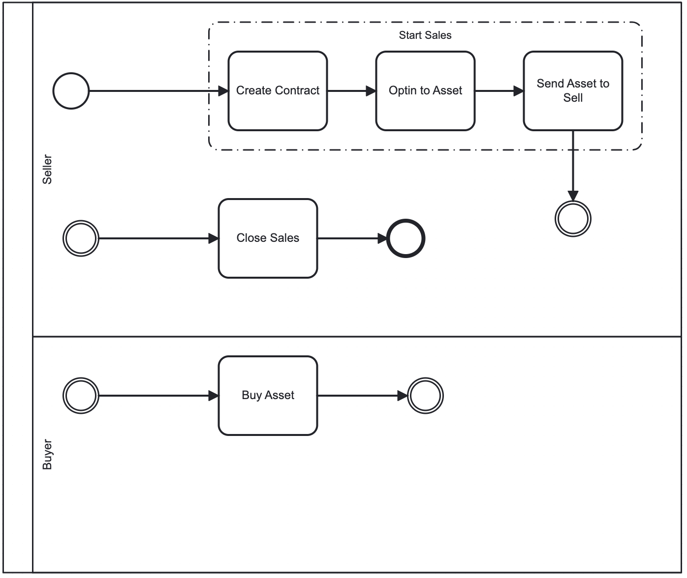

# Digital Marketplace

## What does this application do?

This app is an online marketplace where people can buy and sell digital items like artwork, music, or software. It works in a simple, secure way that doesn’t require a middleman like a bank or a third payment service provider. Any seller can open their own store, represented by a smart contract, send the assets to be sold and allow users to purchase them paying in Algo.

### Actors
1. <strong>Sellers:</strong> Can list their digital items on the app and set a price and amount to be sold. Once listed, their items are available for buyers to see and purchase. At any time, the seller can close the sales and retrieve the revenue generated from the assets sold.
2. <strong>Buyers:</strong> can browse the marketplace to find sellers and their stores (each store is a different smart contract). When making a purchase, the payment will be made in ALGO.

### How it Works
When a buyer makes a purchase, the app ensures that the seller receives the payment and the buyer gets access to the item. Thanks to atomic transactions in Algorand, this happens securely and without needing a bank or third party to process the payment.

A link to the functional deployed version can be found here: [https://link-to-dapp.com]

The workflow executes the following steps:
1. The Seller creates the store through a Smart contract deployment, this generates an application ID that serves for identify the seller's store for an specific item or Asset.
2. For receiving the assets to be sold, the smart contract must execute an opt-in to the asset.
3. Once the smart contract is able to receive the assets, the seller will send the assets to the application's account. By completing this, the store is ready and any users is able to purchase an asset.
4. A buyer can find a specific store with assets listed and purchase one or more assets, sending a payment transaction to the contract and receiving the asset, in order to be able to receive the asset the buyer must have executed an optín to the asset.
5. When the total of assets is sold, or at anytime the seller prefers, the seller user can close the sales and the store to retrieve the earnings of the sales and get back all the assets left. With this process the contract will be deleted and the application flow has ended.

## Application Architecture
This application involves the following components:
- 01 Smart Contract
- 01 Frontend React Client

### Smart Contract Methods
- create_application
  - Initializes the smart contract with initial parameters such as price and asset ID
- set_price
  - Modifies the asset sale price
- opt_in_to_asset
  - Allows the smart contract to receive the asset to be sold
- buy
  - Performs an asset purchase through an atomic transaction involving the ALGO payment and asset transfer
- Delete_application
  - Allows the seller to retrieve the ALGO earned by the assets sold and the assets left, deleting the application (closing the store)

### Frontend key items
- `./src/components/MethodCall.tsx` - The component responsible for routing the contract's methods calls.
- `./src/methods.ts` - This file contains all the logic for executing the system flow calling the smart contract's methods in gropus according to the business logic.
- `./src/Home.tsx` - The main file containing the backbone of the frontend application.

## Setup

### Initial setup
1. Clone this repository to your local machine.
2. Ensure [Docker](https://www.docker.com/) is installed and operational. Then, install `AlgoKit` following this [guide](https://github.com/algorandfoundation/algokit-cli#install).
3. Run `algokit project bootstrap all` in the project directory. This command sets up your environment by installing necessary dependencies, setting up a Python virtual environment, and preparing your `.env` file.
4. To start up the project execute `algokit project run build` in the `projects/DigitalMarketplace-contracts` folder. This compiles your project and prepares its for running. Then execute `npm run dev` into the `projects/DigitalMarketplace-frontend` folder to generate the client linked from the contract start up a local environment for the frontend.

> This project is structured as a monorepo, refer to the [documentation](https://github.com/algorandfoundation/algokit-cli/blob/main/docs/features/project/run.md) to learn more about custom command orchestration via `algokit project run`.

### Changing network
1. In the case of the smart contract, execute `algokit generate env-file -a target_network localnet` from the `DigitalMarketplace-contracts` directory to create a `.env.localnet` file with default configuration for `localnet`.
2. For changing the network with which the frontend will interact, you need to copy the `.env.template` and create your own `env` following the instructions inside of the file by uncommenting the desired network config. Once you do this, the next time you start up the frontend, you will be interacting with the specified network.

## Tools

This project makes use of Python and React to build Algorand smart contracts and to provide a base project configuration to develop frontends for your Algorand dApps and interactions with smart contracts. The following tools are in use:

- Algorand, AlgoKit, and AlgoKit Utils
- Python dependencies including Poetry, Black, Ruff or Flake8, mypy, pytest, and pip-audit
- React and related dependencies including AlgoKit Utils, Tailwind CSS, daisyUI, use-wallet, npm, jest, playwright, Prettier, ESLint, and Github Actions workflows for build validation

### VS Code

It has also been configured to have a productive dev experience out of the box in [VS Code](https://code.visualstudio.com/), see the [backend .vscode](./backend/.vscode) and [frontend .vscode](./frontend/.vscode) folders for more details.

